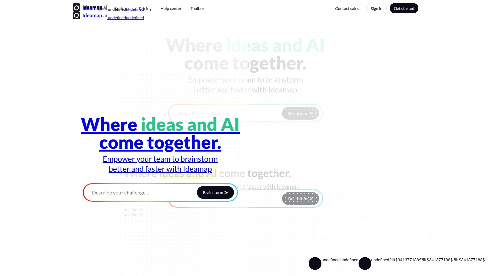
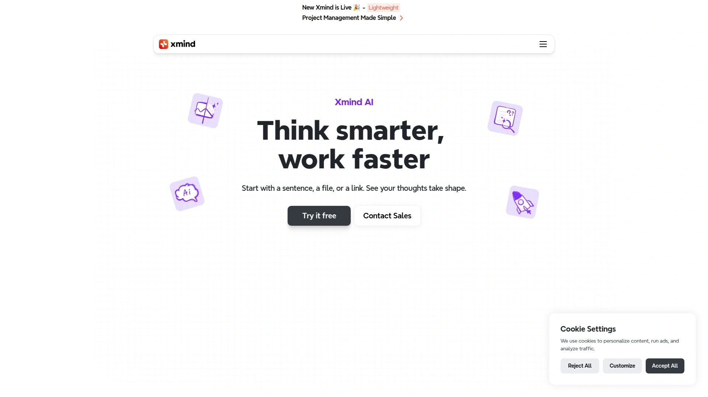
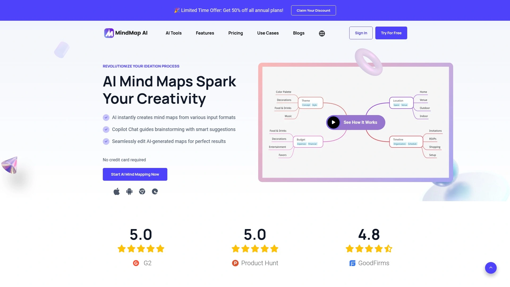
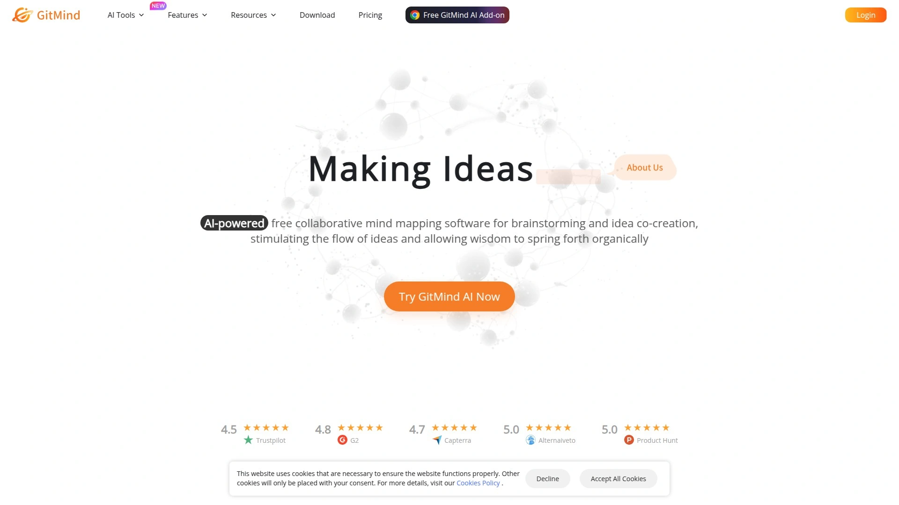
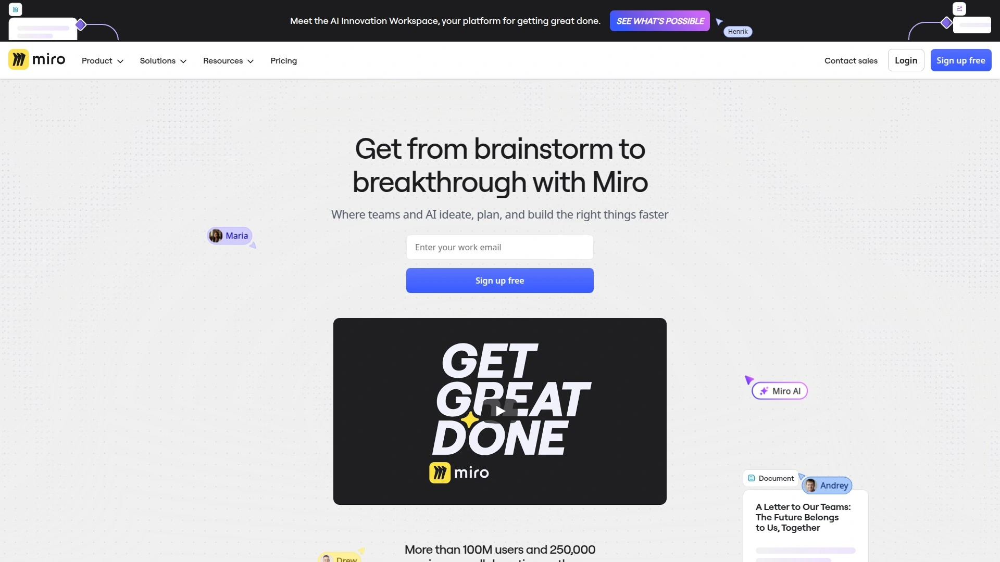
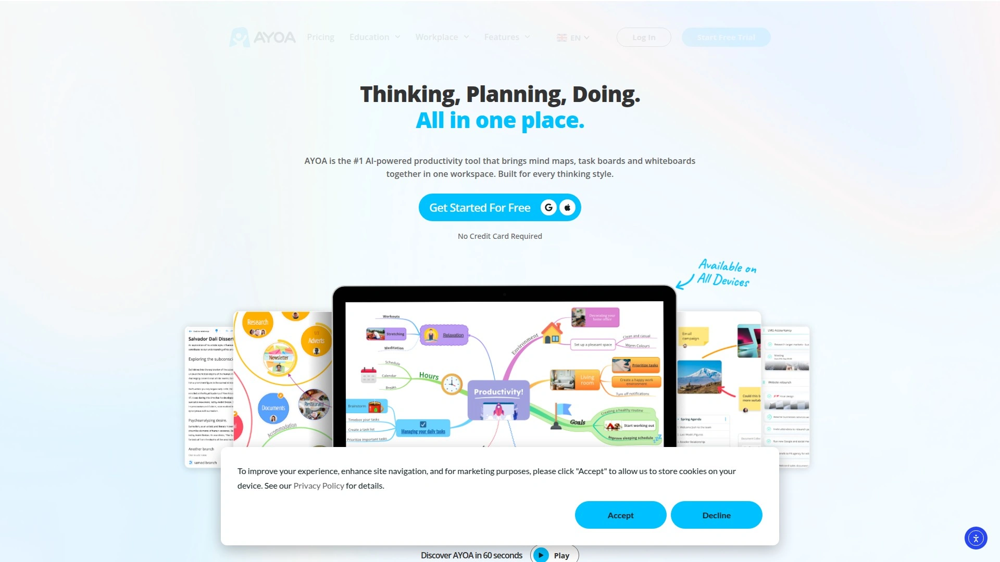
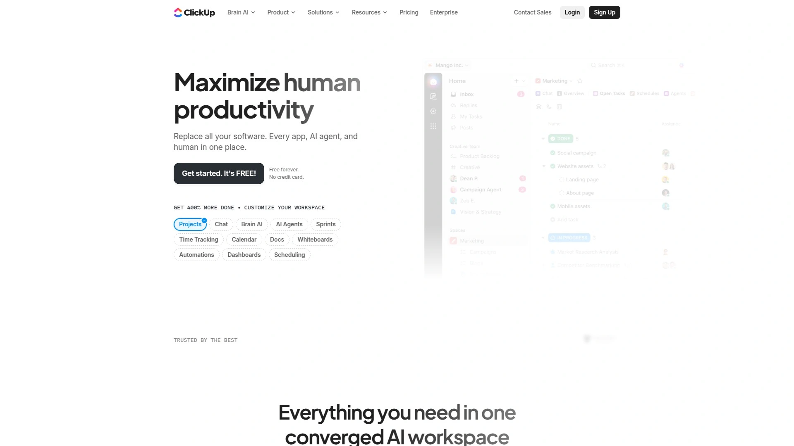

# Top 8 AI Brainstorming & Mind Mapping Tools Ranked in 2025 (Latest Compilation)

Need to transform scattered thoughts into structured strategies? Struggling with creative blocks during team sessions? Modern AI-powered brainstorming and mind mapping tools help you capture ideas faster, visualize complex concepts instantly, and collaborate seamlessly with remote teams—turning chaos into clarity in minutes rather than hours.

---

## **[Ideamap](https://ideamap.ai)**

Visual workspace where AI meets human creativity for explosive team brainstorming.

**What makes it special:** Ideamap turns traditional brainstorming into an interactive experience by combining AI copilots with visual mind mapping. The platform feels like having a tireless creative partner who never runs out of suggestions, helping teams break through mental blocks and discover connections they'd otherwise miss.

**Core capabilities** include real-time collaborative canvases where multiple team members can contribute simultaneously, AI-powered idea generation that expands your thinking in unexpected directions, and built-in games and prompts that keep brainstorming sessions engaging rather than tedious. The tool automatically organizes ideas into structured maps while preserving the organic flow of creative thinking.

**Perfect for** startup teams planning product launches, marketing departments running campaign ideation, and remote teams who need to stay aligned despite geographic distance. The platform excels when you're tackling ambiguous problems that require both structure and creative freedom.

**Why teams love it:** Users consistently praise how Ideamap breaks complex projects into manageable steps while maintaining momentum. The combination of visual organization and AI assistance means ideas don't just get captured—they get developed into actionable frameworks.

---

## **[Xmind AI](https://xmind.com/ai)**

Professional-grade mind mapping enhanced with intelligent AI copilot features.

Xmind AI transforms documents, web pages, and videos into structured mind maps automatically. Drop in any content source and watch the AI analyze it, extract key themes, and build a visual hierarchy in seconds.

The platform offers multiple mapping styles—from radial trees to fishbone diagrams—letting you match the format to your thinking style. Real-time collaboration keeps distributed teams synchronized, while the AI copilot expands branches with contextually relevant suggestions. Export options include presentations, PDFs, and task management integrations.

Teams working on complex technical projects appreciate how Xmind handles intricate relationships without becoming cluttered. Students use it to break down dense academic material into digestible visual frameworks.

**Technical edge:** The AI doesn't just generate content—it understands context, recognizes patterns across your maps, and suggests connections between seemingly unrelated concepts. This makes it invaluable for research-heavy work and strategic planning.

---

## **[MindMap AI](https://mindmapai.app)**

Instant mind map creation powered by sophisticated AI analysis and chat history.

MindMap AI works like having a conversation with your ideas. The AI Copilot maintains chat history for each project, letting you pick up where you left off and build on previous thinking sessions. Upload text files, PDFs, images, or even audio recordings—the system extracts concepts and builds maps automatically.

What sets it apart is the continuous interaction model. Rather than one-shot generation, you can refine nodes, ask the AI to expand specific branches, or request alternative perspectives. The credit-based system means you pay for actual usage rather than flat subscriptions.

Consultants and business strategists find the tool particularly useful for client presentations. The ability to import diverse content types and quickly generate professional visualizations saves hours of manual diagram work.

---

## **[GitMind](https://gitmind.com)**

Free collaborative platform combining mind maps, flowcharts, and org charts in one workspace.

GitMind delivers impressive functionality at zero cost. The AI-powered mapping generates structures from simple text inputs, while real-time collaboration supports unlimited team members. The platform handles not just mind maps but also flowcharts, organizational charts, UML diagrams, and swimlanes.

Templates cover everything from project planning to business strategy, with mobile apps ensuring you can capture ideas wherever inspiration strikes. The clean interface focuses on speed—learn the keyboard shortcuts and you'll be mapping faster than traditional note-taking.

**Best for** analysts who need multiple diagram types, students organizing study materials, and teams that want full-featured tools without budget constraints. The permanent free tier makes it accessible for personal projects and small organizations alike.

---

## **[Miro](https://miro.com)**

Infinite digital canvas where brainstorming meets visual project management.

Miro goes beyond traditional mind mapping to create a complete visual collaboration ecosystem. The infinite canvas accommodates sticky notes, diagrams, images, and mind maps simultaneously—perfect for design sprints and workshops that need flexibility.

Miro AI clusters related ideas automatically, generates suggestions from prompts, and summarizes key themes from extensive brainstorming sessions. Integration with Slack, Jira, Asana, and Google Drive means your visual work connects directly to execution tools. Templates range from retrospectives to customer journey maps.

The platform shines in facilitated workshops. Built-in timers, voting mechanisms, and breakout frames keep large group sessions productive. Whether you're running a three-hour design sprint or managing ongoing product development, Miro adapts to your workflow.

**Enterprise favorite:** Companies choose Miro when they need robust security, extensive integrations, and the ability to scale across hundreds of users while maintaining smooth performance.

---

## **[Coggle](https://coggle.it)**

Beautifully simple mind mapping focused on clarity and real-time collaboration.

Coggle proves that simplicity can be powerful. The tool strips away complexity to focus on what matters—creating clean, understandable mind maps quickly. Real-time collaboration shows cursor movements and edits instantly, making it feel like working on a shared whiteboard.

Unlimited diagrams and image uploads on the free plan mean you can experiment without constraints. The branching design uses organic curves rather than rigid boxes, creating diagrams that feel more natural and less corporate. Change history lets you track evolution of ideas or revert to previous versions.

**Ideal for** educators teaching concepts visually, small teams that value elegance over features, and anyone who wants to start mapping in under 60 seconds. Google Drive integration makes sharing with existing contacts effortless.

---

## **[Ayoa](https://www.ayoa.com)**

Neuro-inclusive productivity tool blending mind mapping with task management and AI.

Ayoa recognizes that different brains work differently. The platform offers multiple mind map styles—radial, organic, speed maps—letting you choose formats that match your thinking patterns. AI features generate ideas, auto-create maps, and provide intelligent suggestions during brainstorming.

What makes Ayoa unique is how it bridges ideation and execution. Transform mind map nodes into tasks, assign them to teammates, track progress with Kanban boards, and manage schedules—all within the same workspace. Whiteboards support freeform exploration when structure feels limiting.

ADHD-friendly design features and accessibility options make it particularly valuable for neurodivergent team members. The focus on inclusive productivity means everyone can contribute their best thinking regardless of how their brain processes information.

---

## **[ClickUp](https://clickup.com)**

Everything workspace where mind mapping integrates seamlessly with project management.

ClickUp treats mind mapping as one piece of a comprehensive work platform. Switch between Mind Map view and traditional task lists with a single click. Two modes serve different needs—Task Mode links existing work items visually, while Blank Mode provides free-form brainstorming space.

The Whiteboard feature complements mind mapping with infinite canvas creativity. Convert any node into an actionable task, assign it to team members, set deadlines, and track progress without leaving the visual environment. AI assistance generates ideas, suggests structures, and helps organize complex projects.

**For teams needing** end-to-end workflow integration, ClickUp eliminates the gap between planning and doing. Marketing teams, software developers, and operations managers appreciate how visual thinking connects directly to daily execution.

---

## **FAQ**

**Which tool works best for remote team brainstorming sessions?**
Miro and Ideamap excel at facilitating remote collaboration with real-time editing, built-in facilitation tools like timers and voting, and AI features that keep sessions productive. Both support async work so teams across time zones can contribute.

**Can these tools replace traditional whiteboard sessions?**
Absolutely. Modern mind mapping tools offer advantages traditional whiteboards can't match—infinite space, instant organization, AI-powered suggestions, persistent history, and seamless sharing. Plus, remote participants contribute equally rather than being passive observers.

**How do AI features actually improve brainstorming?**
AI acts as a creative catalyst by generating unexpected connections, expanding ideas you hadn't fully explored, summarizing complex discussions into key themes, and suggesting directions when teams hit mental blocks. It's like having an extra team member who never gets tired.

---

## **Conclusion**

Whether you're mapping product strategy, organizing research, or running creative workshops, these AI-powered tools transform how ideas evolve from scattered thoughts into actionable plans. [Ideamap](https://ideamap.ai) stands out for teams tackling ambiguous challenges who need both AI intelligence and human creativity working in harmony—making it perfect for startups and innovation-focused groups who can't afford to waste time on tools that slow them down.
